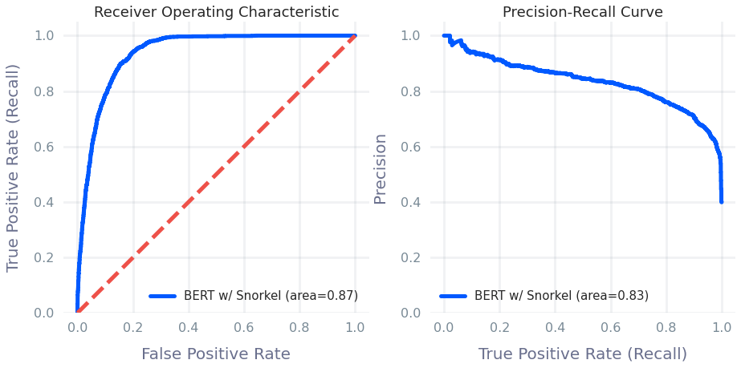

<br/><br/><br/><br/>

----------

# 365 Days of Online Abuse

**The Inner Join Story**: https://innerjoin.bit.io/365-days-of-online-abuse-8a88855bb1a6
**The Code Caviar Story**: https://www.bingyune.com/blog/abusive-language-2020

## Project Overview

**Automatically label vast amounts of training data using weak supervision and transfer learning**

The rise in abusive language across the global online community is correlated with a rise in discrimination against minorities. The potential for abusive language to incite violence has also increased in the era of social media platforms because of the speed with which cyberbullying, hate speech, and scapegoating can spread online. Consequently, there is an urgent and necessary need to improve the detection of online abusive language and enable effective responses to communities impacted by abusive online behavior.

One common approach is to train computer algorithms using natural language processing and data manually labeled by content moderators to teach AI models how to flag abusive language faster and better than their human counterparts. However, most of the needed training data for abusive language detection is not in a labeled form and data labeling teams don't usually know the social context of the text data they are labeling.

Here, we walk you through a data programming approach for labeling tweets using weak supervision with Snorkel and transfer learning with BERT to explore the challenges of automatically creating labeled datasets for abusive language detection. These tweets were randomly filtered for English language from the "Spritzer" version of the Twitter API Stream. Our aim is to emphasize best practices, so that you will be able to generate high-quality labels at scale.

## Summary of Results

Snorkel is a technique built around the programming paradigm of using weak supervisors to create, model, and manage labeled data. Remember that weak supervision helps us alleviate the time and cost of building hand-labeled training datasets. By combining higher level supervision (as opposed to case-by-case labeling) and various statistical techniques to improve accuracies of noisy labels, the outlined approach was able to cheaply build a classifier to accurately detect abusive language in tweets. The tweets were programmatically annotated (0 = no abuse, 1 = abuse) using weak supervision with Snorkel and transfer learning with BERT. Quality assurance methods, such as benchmarking against ground truth labels and checking for consensus between labeling functions, were also applied to improve the overall data quality of the new labels. The approach attained a 0.88 F1 score in an abusive language detection task on the test set of ground truth labels. However, more work is still needed to reduce the number of false positives in the production data.



The ROC curve (receiver operating characteristic curve) is a graph showing performance of a classification model at all classifications thresholds for True Positive Rate and False Positive Rate. The Area under the ROC Curve (AUC) provides an aggregate measure of performance across all possible thresholds, where an AUC of 1.0 is whose predictions are 100% correct - 0.87 for trained classifier may be overly optimistic. Alternatively, the Precision-Recall curve summarizes the trade-off between the True Positive Rate (Recall) and the Positive Predictive Value (Precision) for different classification thresholds. The Precision-Recall curve is better suited for our testing data with a moderate class imbalance. A model with perfect performance has a point at (1,1), while a model that performs better than a no-skill classifier (cannot distinguish between the classes) has a curve that bows towards (1,1) - our final, trained BERT model is overly confident at correctly classifying ABUSE, but noticeably worse at correctly classifying NO_ABUSE.

## Getting Started

Cloning the git repository and installing the provided packages will help you get a copy of the project up and running on your local machine. The analysis for this project was performed using Jupyter Notebook (.ipynb) and the packages were managed using the Anaconda platform.

```
git clone https://github.com/codecaviar/abusivelanguage2020.git
conda env create -f environment.yml
```

File Description:
* environment.yml - packages used to perform this analysis (on Google Colab)   
* ntbk_01_labeled_collect_data.ipynb - collect data for raw hand-labeled data from [University of Sheffield](https://github.com/ziqizhang/data#hate)
* ntbk_02_labeled_clean_data.ipynb - clean data for raw hand-labeled data
* ntbk_03a_labeled_train_lf_classifers.ipynb - build classifiers as labeling functions using raw hand-labeled data (as ground truth labels)
* ntbk_03b_labeled_build_lf_funcs.ipynb - build additional common labeling functions for this task
* ntbk_04a_labeled_finetune_bert_twitter.ipynb - fine tune BERT model using the [Sentiment140](https://www.kaggle.com/kazanova/sentiment140) dataset
* ntbk_04b_labeled_train_bert_gold_labels.ipynb - train BERT model using the ground truth labels in X_train
* ntbk_04c_labeled_train_bert_snorkel_labels.ipynb - train BERT model using the Snorkel labels in X_train
* ntbk_05_unlabeled_collect_data.ipynb - collect data for raw unlabeled data from the [Archive Team Twitter Stream](https://archive.org/details/archiveteam-twitter-stream-2020-11)
* ntbk_06_unlabeled_clean_data.ipynb - clean data for raw unlabeled data
* ntbk_07a_unlabeled_label_bert_gold.ipynb - process BERT-labeled data to check quality against hand-labeled data
* ntbk_07b_unlabeled_label_bert_snorkel.ipynb - process BERT-labeled data to create [AbusiveLanguage2020](https://bit.io/codecaviar/abusivelanguage2020?utm_source=medium&utm_medium=blog&utm_campaign=hspeech)

## Author

- **BingYune Chen** - [LinkedIn](https://www.linkedin.com/in/bingyune-chen/)
- **BingYune & Co** - [GitHub](https://github.com/codecaviar)

## License

This project is licensed under the MIT License - see the [LICENSE](LICENSE) file for details

## Acknowledgments

**The Inner Join** by [bit.io](http://bit.io/)
An inner join is the overlap between two datasets, resulting in the intersection. The Inner Join blog from bit.io is inspired by that concept. We examine how data crosscuts our lives and share every step of the process. Learn from us, learn with us, and let us learn from you by contributing data and insights at bit.io.

----------
The Code Caviar is a digital magazine about data science and analytics that dives deep into key topics, so you can experience the thrill of solving at scale.
